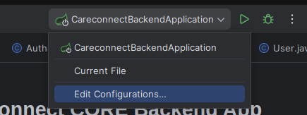
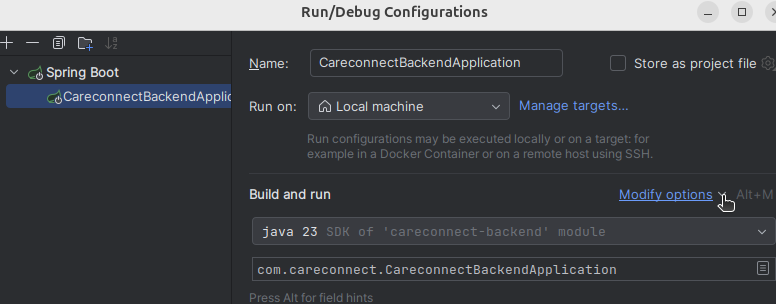

# CareConnect CORE Backend App
This is the first backend app after the prototype of CareConnect that is ready for testing. 
This README will help you set it up on your local computer.


## Context of those instructions

- They are generate based on a Linux (Ubuntu) VM.
- Intellij IDEA was used (You can get a student license through UMGC)

Although, the following would be similar to most platforms an IDEs you want to use.

## Prerequisite
- Install Git you can follow this link.
- Install MySQL Server and needed Driver.
- Clone the code (your branch if you are planning on make changes to the code).


## Environment Configuration
1. Open your IDE and open the ***`core`*** project/folder with your IDE

2. Add your env variables
    
    - By Default advanced IDE like Intellij just generate a Run Configuration for you 
    based of the file with the entrypoint/touchpoint.<br/>To keep things simple just edit it.
        1. Go to the name of the main class show on the top right see image below. Click on `Edit Configurations...`
        
    
        2. With the Run Configuration of the name of the class selected make sure `Environment Variables` is showing up.
        
            - If you do not see `Environment Variables`<br/>Click on the `Modify options` dropdown and check `Environment Variables`. See below
            

        3. Add your variables in the `Environment Variables` field, like so. The values in the example should match what you can use.
        ```
        ADMIN_EMAIL=bomplar@gmail.com;ADMIN_EMAIL_PASSWORD=<SENSITIVE>;DB_PASSWORD=<ADD YOUR USER DB PASSWORD HERE>;DB_USER=root;JDBC_URI=jdbc:mysql://localhost:3306/careconnect;MAIL_HOSTNAME=smtp.gmail.com;MAIL_PORT=587
        ```
        
        The format is simple `KEY=value;NEW_KEY=value` <br/>You can also use a file if you prefer or add the variable with the GUI. 
        
        - Click on the last button of the `Envirionment Variables` field. You should see a screen like below, fill it out like by line.
                


## Run the Spring Boot Backend App
On your terminal
```bash
cd careconnect2025/backend/core     # Navigate into the backend folder
# Open in IntelliJ IDEA or your preferred Java IDE.
# OR build with Maven:
./mvnw spring-boot:run              # For Linux/Mac
mvnw spring-boot:run                # For Windows
# OR use IntelliJ "Run" button
```

---

## Optional Tools

* [**Postman**](https://www.postman.com/downloads/) or [**Bruno**](https://www.usebruno.com/downloads) – For manual API endpoint testing.
* MySQL Workbench - To manipulate your database

---

## Support

For credentials, setup help, or onboarding, contact your team lead or project maintainer.

---

***Note: `application.properties` setup will be improved soon to follow current best practices for secrets and environment management.***


## Deployment on AWS
This can be done after create the infrastructure resources using the Terraform scripts. Follow the README(s) for more on the Terraform scripts.
<br/>Those commands are provided on AWS ECR as well. 

1. Install Docker on your computer. Jump to step 2 if you already have docker.
2. Install and Configure your AWS Cli. Jump to step 3 if you have done that already.
3. Create a .env file in the same directory of the DOckerfile. Add all the required environment variables with the their value on one single line each. Format: `VARIALBLE=VALUE`. Those variables would be the same as what you would use in the run configirations explained above.
4. Run these commands: 
```sh
aws ecr get-login-password --region us-east-1 | sudo docker login --username AWS --password-stdin 641592448579.dkr.ecr.us-east-1.amazonaws.com # To authenticate to ECR

sudo docker build -t cc_core_ecr . # To build the image in your local

sudo docker tag cc_core_ecr:latest 641592448579.dkr.ecr.us-east-1.amazonaws.com/cc_core_ecr:latest # To create a new tag of the created image (Duplicate it with a new tag[name])

sudo docker push 641592448579.dkr.ecr.us-east-1.amazonaws.com/cc_core_ecr:latest # To push the image to AWS ECR
```